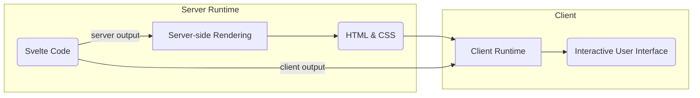

I was asked recently (about 2 hours ago) if there was a way to have some kind of macros with HTML. You may know Svelte as a declarative framework for reactive user interfaces in the browser, **but Svelte can also be a very effective (and elegant) templating language.**

The Svelte compiler supports two output formats: `client` --- the one for reactive user interfaces --- and `server` --- the one that renders Svelte as HTML and CSS on the server. The `server` output is what enables using Svelte as a generic JavaScript templating language.

Here is the typical render flow of a SvelteKit application with [hydration](https://svelte.dev/docs/kit/glossary#Hydration) enabled:



The [`svelte`](https://npmx.dev/package/svelte) npm package exposes all that's needed to reproduce this _Svelte code → HTML & CSS_ transformation in isolation, outside of a full SvelteKit application. The rest of this article is about using these primitives.

## Minimal example

You'll need Node and npm installed on your machine to reproduce this example.

In an empty directory, run `npm add svelte` to download the [`svelte`](https://npmx.dev/package/svelte) npm package. You'll get a `package.json` (project manifest), a `package-lock.json` (dependency lock file), and a `node_modules` directory (actual code of the dependencies) in your newly created directory.

From there, you can run JS code with Node:

```js
// index.mjs
import { VERSION } from "svelte/compiler";
console.log("Installed Svelte %s", VERSION);
```

```
❯ node index.mjs
Installed Svelte 5.57.0
```

So far so good, let's try to do something more interesting: compile a piece of Svelte code.

```js
import { compile } from "svelte/compiler";

const { js } = compile(
  `<ul>
    {#each Array(5), i}
      <li>{i}</li>
    {/each}
  </ul>`,
  { generate: "server" },
);

console.log(js.code);
```

Running this code should produce the following output (or close to it):

```js
import * as $ from "svelte/internal/server";

export default function _unknown_($$renderer) {
  $$renderer.push(`<ul><!--[-->`);

  const each_array = $.ensure_array_like(Array(5));

  for (let i = 0, $$length = each_array.length; i < $$length; i++) {
    $$renderer.push(`<li>${$.escape(i)}</li>`);
  }

  $$renderer.push(`<!--]--></ul>`);
}
```

You can see that our [`{#each}` block](https://svelte.dev/docs/svelte/each) was turned into a standard `for` loop that pushes HTML strings into what is effectively the output.

Now, instead of `console.log`ging the compiled code, let's evaluate it. It turns out evaluating an ESM module from a string is quite a difficult problem, but [there are several solutions](https://www.zachleat.com/web/dynamic-import/); we'll use `await import()` from a `data:` URI to evaluate the compiled code directly:

```js
import { compile } from "svelte/compiler";
import { render } from "svelte/server";

const { js } = compile(
  `<ul>
    {#each Array(5), i}
      <li>{i}</li>
    {/each}
  </ul>`,
  { generate: "server" },
);

// Replace `import "svelte/internal/server"` with a fully resolved path
const code = js.code.replaceAll(
  /(import.+?["'])(.+?)(["'])/g,
  (_, start, id, close) => start + import.meta.resolve(id) + close,
);

// Evaluate the compiled code as an ESM module from a data URI
const component = await import(
  `data:text/javascript;charset=utf-8,${encodeURIComponent(code)}`
);

console.log(render(component.default).body);
```

```html
<!--[-->
<ul>
  <!--[-->
  <li>0</li>
  <li>1</li>
  <li>2</li>
  <li>3</li>
  <li>4</li>
  <!--]-->
</ul>
<!--]-->
```

(This snippet is pretty printed, yours is very likely minified.)

A bit busy because of all the hydration markers, but nothing that we can't remove:

```js
import { compile } from "svelte/compiler";
import { render } from "svelte/server";

const { js } = compile(
  `<ul>
    {#each Array(5), i}
      <li>{i}</li>
    {/each}
  </ul>`,
  { generate: "server" },
);

const code = js.code.replaceAll(
  /(import.+?["'])(.+?)(["'])/g,
  (_, start, id, close) => start + import.meta.resolve(id) + close,
);
const component = await import(
  `data:text/javascript;charset=utf-8,${encodeURIComponent(code)}`
);
const { body } = render(component.default);

console.log(body.replaceAll(/<!--.+?-->/g, ""));
```

...and voilà!

```html
<ul>
  <li>0</li>
  <li>1</li>
  <li>2</li>
  <li>3</li>
  <li>4</li>
</ul>
```

This should be enough to get you started on using Svelte as a templating language, but we can go a bit further with a few more tools.

## With a bundler

Let's add more friends (dependencies) to our `package.json`: `npm add -D rolldown rollup-plugin-svelte`.

- [Rolldown](https://rolldown.rs/) is a bundler: it transforms a bunch of files with imports into a single file that can be executed anywhere.
- [rollup-plugin-svelte](https://npmx.dev/package/rollup-plugin-svelte) will allow Rolldown to understand and compile Svelte components.

We configure Rolldown by creating a `rolldown.config.mjs` file and registering the `rollup-plugin-svelte` plugin:

```js
// rolldown.config.mjs
import { defineConfig } from "rolldown";
import svelte from "rollup-plugin-svelte";

export default defineConfig({
  input: "index.mjs",
  output: { file: "bundle.mjs" },
  platform: "node",
  plugins: [svelte({ compilerOptions: { generate: "server" } })],
});
```

Note that we set `generate: "server"` like in the previous example: all Svelte components will be compiled for server-side rendering.

With this setup, Svelte components can now live in their own files. For instance, let's create a `List.svelte` component:

```svelte
<!-- List.svelte -->
<ul>
  {#each Array(5) as _, i}
    <li>{i}</li>
  {/each}
</ul>
```

Now, we can import and render this component in our `index.mjs` file:

```js
// index.mjs
import List from "./List.svelte";
import { render } from "svelte/server";

const { body } = render(List);

console.log(body.replaceAll(/<!--.+?-->/g, ""));
```

We can no longer run `index.mjs` directly through Node: `.svelte` components are not natively supported by Node. **We need a new intermediate step** --- _bundling_ --- before we can execute our code.

```
❯ npx rolldown -c
<DIR>/bundle.mjs  chunk │ size: 55.81 kB

✔ rolldown v1.2.8 Finished in 27.91 ms

❯ node bundle.mjs
<ul><li>0</li><li>1</li><li>2</li><li>3</li><li>4</li></ul>
```

This setup is more convoluted than the previous one but **scales much better**: your components can be organized into separate files, and you get syntax highlighting and autocompletion in your editor.

If you are curious to see real-life examples of this setup in action, check out [svelte-emails](https://github.com/GauBen/svelte-emails), which uses Svelte components as email templates.

This article was written a bit hastily, so feel free to reach out if you have suggestions for improvement.
